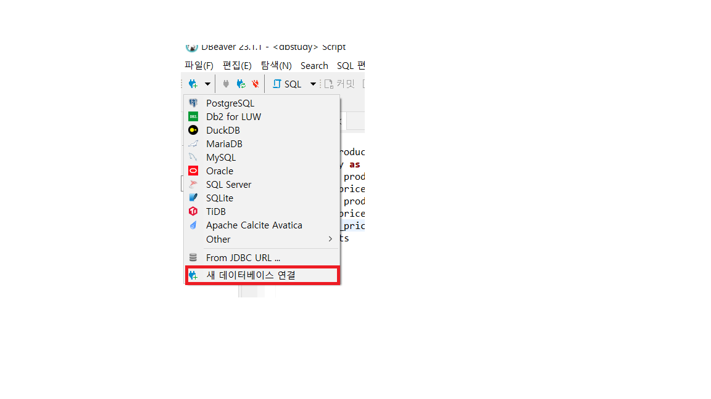
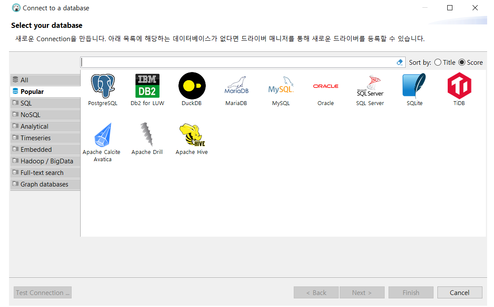
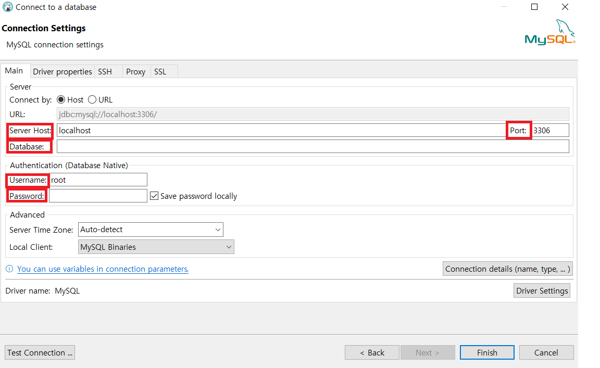

# 1.DB란?
    * DB란 컴퓨터 안에 기록된 문자 또는 숫자를 의미
    * 데이터의 집함을 DB라고 한다.


# 2. DB? RDB? DBMS? RDBMS?
    * 데이터 베이스를 효율적으로 관리하는 소프트웨어를 DBMS(데이터베이스 관리 시스템 : Database Management System) 이라고 한다.
    * 데이터를 표 형태로 구조적으로 관리하는 모델을 관계형 모델이라한다. -> Relational Model -> RDB
    * RDB를 관리하는 시스템을 RDBMS라고 한다.
    * RDBMS의 대표 소프트웨어 Oracle, DB2, SQL Server PostgreSQL, MySQL, SQLite 등이 있다.
    * SQL 이란? -> RDBMS의 데이터를 관리하기 위한 프로그래밍 언어


# 3. RDB의 구성요소
    * 행, 열, 가상 테이블(VIEW), 행의 주소(INDEX), 시퀸스(SEQUENCE, 고유번호 자동 생성), 객체의 별칭(시노임, SYNONYM)


# 4. SQL(Structured Query Language)
    * 스토리지 언어의 표준으로 DB를 사용하여 프로젝트를 한다면 다룰 줄 알아야한다.
    ```
    SELECT * FROM Customers;
    ```
    ## 4-1 명령어의 분류
        ### 데이터 조작어(DML)
            * SELECT
            * INSERT
            * UPDATE
            * DELETE
        ### 데이터 정의어(DDL)
            * CREATE DATABASE
            * CREATE TABLE
            * CREATE INDEX
            * ALTER DATABASE
            * ALTER TABLE
            * DROP TABLE
            * DROP INDEX
            * RENAME
            * TRUNCATE
        ### 데이터 제어어(DCL)
            * GRANT : 권한부여
            * REVOKE : 권한제거
        ### 트랜젝션 제어어(TCL)
            * COMMIT
            * ROLLBACK
            * SAVEPOINT


# 5. DATA 분석 과정
    5-1. 데이터 -> 목표데이터(Target Data) -> 전처리 데이터(Preprocessed Data) -> 데이터 반환(Transformed Data) -> 패던(Patteerns) -> 지식(Knowledge)

    5-2. 사전 데이터 분석 및 1~3번까지 단계가 전체 과정의 70 ~ 80%

# 6. 정형? 비정형? 데이터
    6-1 정형 -> 테이블 안에 들어가 형식이 잡혀있는 데이터
        * 주로 숫자로 이루어진 데이터
        * 행렬 구조를 가지며, 연산이 가능하고, 일관성을 가진다.
    
    6-2 반정형 -> 스키마 구조 형태를 가지고 있는 데이터
        * 메타 데이터 포함, 값과 형식이 일관 x 연산x

    6-3 비정형 -> 정의된 데이터 모델이 없거나, 정의된 방식으로 정리 되지 않는 정보
        * 구조가 정해지짖 않은 데이터
        * 연산 x


# 7. CRUD
    * C -> Create
    * R -> Read
    * U -> Update
    * D -> Delete


# 8. 실습을 위한 데이터 세트 준비
    8-1 DBeaver 설치

    8-2 데이터베이스 선택
    

    8-3 SQL 선택
    

    8-4 setting
        * Server Host, Databse, UserName, Password, Port 설정
    


# 9. SElECT, FROM
    9-1 SQL 쿼리를 입력하고, 결과 조회
        * SELECT 문을 이용해 DB에 있는 데이터 조회
        ```
        select 1;
        ```
        * 숫자를 그대로 출력 가능
        * 연산자 사용 가능(+, -, *, /) // 우선순위가 켜진다. ( 곱하기 -> 나누기 -> 나머지가 먼저 연산된다.)

        * 문자열을 그대로 출력 가능, 문자열 더하기
            * select 'hello world'; -> hello world 출력
            * select 'hello' + 'world'; -> x 문자열은 더하기가 되지않는다.
            * 문자열을 더하고 싶으면 select 'hello' || 'world';
        
        * 전체 정보 출력하기
            * select * from data;
        * 특정 column 선택하기
            * first_name을 선택하고 싶으면
            * selcet first_name * users;
        * 여러개 column 선택하기
            * select id, first_name, last_name from users;


# 10. AS
    10-1 AS란?
        * 해당 컬럼의 이름을 다시 정해서 나타내는 기능
        * 주로 식으로 된 컬럼의 컬럼명을 설정 OR 기존의 컬럼명을 간결하게 보여주기 위해 사용
        ```
        select name as product_name
        from products
        ```
        * 테이블 명 지정
        ```
        select
            a.id,
            a.name
        from products as a
        ```


# 11. LIMIT
    11-1 LIMIT이란?
        * 조회한 레코드 결과의 수를 제한한다.
        * LIMIT 없이 조회하면 모든 데이터를 조회하지만, LIMIT을 이용하면 원하는 갯수만큼 가지고 올 수 있다.
        ```
        select * from users limit 5;
        ```

        ```
        select *
        form products
        limit 3;
        ```


# 12. DISTINCT
    12-1 DISTINCT란?
        * 결과에서 중복된 행을 제거한다.
        ```
        select distinct country
        from users
        ```


# 13. WHERE
    13-1 WHERE 이란?
        * 원하는 데이터만 필터링한 결과를 조회
        * 여러 연산자를 결합하여 사용 가능
        * 비교연산자(=, <, >, !=, >=, <=), SQL연산자(BETWEEN), 논리 연산자(AND, OR) 등 사용가능
        ```
        SELECT *
        FROM users
        WHERE first_name = 'Michael';
        ```


# 14. SQL 연산자
    14-1 논리 연산
        * 우선순위는 NOT, AND, OR
        * AND - 모든 조건을 만족한 레코드를 조회
            ```
            select * from users
            where id < 10000
            and first_name = 'David'
            ```
        * OR - 조건을 하나라도 만족하면 레코드 조회
            ```
            select * from users
            where age < 20
            or age > 60
            ```

            ```
            select * from users
            where first_name = 'David'
            and (age < 20 or age > 60)
            ```
        * NOT - 조건 값이 아닌 레코드 전체 조회
            ```
            select * from users
            where NOT(country = "United States')
            ```

            ```
            select * from users
            where NOT (country = 'United States' or country = 'Brasil);
            ```

    14-2 BETWEEN 연산
        * between A AND B : A 와 B를 포함한 사이의 값을 조회
            ```
            select *
            from users
            where create_at between '2020-01-01' and '2020-02-01'
            ```

    14-3 IN 연산
        * IN A : A 안에 값과 일치하는 값을 조회
            ```
            select *
            form products
            where brand in ('Onia', 'Hurley', 'Matix')
            ```

    14-4 LIKE 연산
        * LIKE - '비교문자'
        * 비교 문자와 형태가 일치 (%(모든문자),_(한글자)사용)
        * 대소문자를 안가린다.
        * % 는 와일드 카드
            ```
            select *
            from products
            where name like '% Young %'
            ```

    14-5 IS NULL
        * NULL 값을 갖는 값(0은 값이 있는 것이다.)
            ```
            select *
            from order_items
            where shipped_at IS NULL;
            ```

            ```
            select *
            from order_items
            where shipped_at IS NOT NULL
            ```
        * 참고사항 - NULL(빈값) !='NULL(문자값)' 서로 타입이 다르다


# 15. 집계 함수
    * 집계함수는 여러행으로 부터 하나의 결과값을 반환하는 함수다.

    15-1. COUNT
        * count 함수는 레코드의 개수를 반환한다.
        ```
        select count(id)
        from users;     ===> 유저의 수를 반환
        ```

        * 참고사항 - count(*)  = null 값을 포함한다.
                    count(컬럼명) = null값을 포함하지 않는다.

    15-2. SUM
        * 합계를 반환 하는 함수
        ```
        select sum(retail_price)
        from products
        ```

    15-3. AVG
        * 평균을 반환 하는 함수
        ```
        select avg(cost)
        from products
        ```

    15-4. MAX
        * 최대값을 반환 하는 함수
        ```
        select max(cost), max(retail_price)
        from products
        ```

    15-5. MIN
        * 최소값을 반환 하는 함수
        '''
        select min(cost), min(retail_price)
        from products
        ```
    
    15-6. VARIANCE
        * 분산을 반환 하는 함수
        ```
        select variance(retail_pirce)
        from products
        ```
    
    15-7. STDDEV
        * 표준편차를 반환 하는 함수
        ```
        select stddev(retail_price)
        from products
        ```
    

# 16. GROUP BY
    * 특정 항목을 그룹화 하여 조회할 수 있다.
    * 그룹화하려는 항목이 select에 들어가야한다.
    ```
    select
        gender,
        avg(age)
    from users
    group by gender;
    ```

# 17. HAVING
    * 그룹화된 데이터에 조건을 부여한다.
    * 그룹화된 데이터와 같이 사용되므로 GROUP BY 와 같이 사용된다.

        * 다음 쿼리는 국가 별로 그룹화 하고, 유저수가 4000 이상인 국가와 유저수를 조회한다.

        ```
        select
            country,
            count(id) as user_count
        from users
        group by country
        having count(id) >= 4000;
        ```


# 18. ORDER BY
    * 출력 결과를 정렬한다
        * 오름차순 -> ASC(작은수에서 큰수로, Ascending)
        * 내림차순 -> DESC(큰 수 에서 작은 수로, Descending)
    18-1 나이순으로 정렬
        ```
        select *
        from users
        order by age asc;
        ```

    18-2 나이 내림차순으로 정렬
        ```
        select *
        from users
        order by age desc;

    18-3 정렬을 여러개 할 경우
        ```
        select *
        from users
        order by age desc, id asc;


# 19. 작성 순서
    * from
    * where
    * group by
    * having
    * select
    * order by
    * limit


# 20. SQL 함수
    20-1. SQL 함수란?
        * 미리 정의된 기능 모음
        * 단일행 함수와 그룹 함수로 나뉜다.
    
    20-2. 숫자 함수

        20-2-1. ROUND
            * 숫자를 반올림 하여 출력하는 함수
            * 0이 소수점 첫째자리이다.
                ```
                select round(반올림 할 숫자, 자릿수)
                ```

        20-2-2. TRUNC
            * 숫자를 내림하여 출력하는 함수
            * 0이 소수점 첫째자리이다.
                ```
                select trunc(숫자, 자릿수)
                ```

        20-2-3. MOD
            * 숫자를 나누기 하여 나머지를 출력하는 함수
                ```
                select mod(숫자, 나눌값)
                ```
            
                ```
                select mod(10,3) -> 1
                ```

        20-2-4. POWER
            * 숫자를 제곱하여 출력
                ```
                select power(숫자,승수)
                ```

        20-2-5. SQRT
            * 숫자를 제곱근 하여 출력하는 함수
                ```
                select sqrt(숫자)
                ```

    20-3. 문자열 함수

        20-3-1. SURSTR
            * 문자열 일부만 출력 할 수 있다.
                ```
                select substr(문자열, 시작위치, 길이)
                ```
        
        20-3-2. LEFT
            * 문자열의 왼쪽 부터 얼만큼 자를지 설중 후에 조회
                ```
                select left(문자열, 길이)
                ```

        20-3-3. RIGHT
            * 문자열 오른쪽에서 부터 자른 후 조회
                ```
                select right(문자열, 길이)
                ```

        20-3-4. CONCAT
            * 여러 문자열을 하나로 연결 할 수 있다.
                ```
                select concat('win','-','ever')
                ```

            * ||을 이용해서도 연결이 가능하다.
                ```
                select 'first_name' || 'last_name'
                ```
        
        20-3-5. LOWER
            * 문자열을 모두 소문자로 변경한다.
                ```
                select lower('ABC')
                ```

        20-3-6. UPPER
            * 문자열을 모두 대문자로 변경한다.
                ```
                select upper('Abc')
                ```

        20-3-7. INITCAP
            * 앞에 문자만 대문자로 만들어준다.
                ```
                select initcap('abcde')
                ```

        20-3-8. REPLACE
            * 바꾸고 싶은 값으로 대상값을 교체
                ```
                select replace('hello word', 'world','sql')
                ```

                ```
                select replace('문자열','바뀔 문자열','바꾸고 싶은 문자열')
                ```
        
        20-3-9. LENGTH
            * 문자열 길이 출력한다.
                ```
                select length('hello world')
                ```

        20-3-10. POSITION
            * 문자열의 위치를 구한다.
            * INDEX는 1부터 시작하며 찾는 문자가 없는 경우 0을 반환한다.
                ```
                select POSITION('b', IN 'abcedf')
                ```

        20-3-11. coalesce
            * 해당값에 NULL값이 있는 경우 다른 값을 채워 넣을 수 있다.
                ```
                select coalesce(name,'담당자 지정 안됨')
                ```
        
        20-3-12. ASCII
            * 아스키코드 번호로 반환하는 함수
                ```
                select ascii('A')
                ```

    20-4. 형변환
        
        * CAST(데이터 AS 타입명)

        20-4-1. 문자열
            ```
            # 문자열 -> 숫자로 바꾸는거
            # 문자열 -> 자연수(INTEGER)
            # 문자열 -> FLOAT

            select CAST('123' AS INT);
            select '123' + '123' # 에러;
            select CAST('123' AS INT) + CAST('123' AS INT);
            select CAST('123.123' AS FLOAT);
            select CAST('123' AS NUMERIC);
            select CAST('123.123' AS NUMERIC);

            select '123'::INT;
            select '123.123'::NUMERIC;
            select '123.123'::TEXT;
            ```

        20-4-2. 숫자열
            ```
            # 숫자(INTEGER) -> 문자
            # 숫자(FLOAT) -> 문자
            # true, false -> 문자
            select CAST(123 AS TEXT)
            select CAST(123.123 AS TEXT)
            select CAST(true AS TEXT)
            select CAST(false AS TEXT)
            select CAST(NULL AS TEXT)

            select 123::TEXT;
            select 123.123::TEXT;
            select true::TEXT;
            ```
        
        20-4-3. 날짜
            ```
            # 날짜 타입
            # 1) DATE
            # 문자열 -> DATE
            # 2) DATETIME
            # 문자열 -> DATETIME
            select DATE('2011-12-01 11:12:34')

            SELECT '2011-12-01 11:12:34'::DATE;
            SELECT '2011-12-01 11:12:34'::TIME;
            SELECT '2011-12-01 11:12:34'::TIMESTAMP;
            ```

# 21. 날짜 함수
    21-1. 날짜
        ```
        SELECT CURRENT_DATE;
        select current_timesmap;
        select now();
        ```

        ```
        select '2023-1-1'::DATE
        ```

        ```
        select created_at::DATE
        from users
        ```

        * 데이터 추출
            ```
            SELECT EXTRACT(YEAR FROM DATE '2023-1-1');

            SELECT EXTRACT(MONTH FROM DATE '2023-1-1');

            SELECT EXTRACT(DAY FROM DATE '2023-1-1');

            SELECT EXTRACT(DAY FROM CURRENT_DATE);
            ```

            ```
            select extract(year from date(created_at))
            from users
            ```
    
    21-2. 시간
        * SELECT NOW() - NOW를 통해서 현재 시간을 알아 낼 수 있다.
            ```
            SELECT '2023-12-25 05:30:00+00'::TIME

        * 데이터 추출
            ```
            SELECT EXTRACT(HOUR FROM NOW());
            
            select extract(hour from created_at)
            from users

    21-3. TO_CHAR(날짜)
        ```
        TO_CHAR(date_expr, format_string)
        ```
    
    21-4. TO_CHAR(날짜 & 시간)
        ```
        SELECT TO_CHAR(TIMESTAMP '2023-01-25 15:30:00', 'YY/MM/DD HH24:MI:SS') AS KR_format;
        ```

    21-5. 날짜 차이 구하기
        ```
        select DATE '2023-08-27' - DATE '2023-06-36' AS date_difference;

        select '2023-08-28'::DATE - '2023-06-26'::DATE;

        select TIME '12:30' - TIME '10:45' AS time_difference;

        select TIMESTAMP '2023-06-27 12:30' - TIMESTAMP '2023-06-26 10:45' AS time_difference;

        select delivered_at - created_at 
        from orders
        where status = 'Complete'
        ```

    21-6. interval
        * 지정된 사간 간격을 추가 및 뺴는 함수
        * DATE + interval
            ```
            select '2023-1-25'::DATE + interval '5 day';

            select '2023-1-25'::DATE + interval '5 month';

            select '2023-1-25'::DATE + interval '5 year';

            SELECT created_at - INTERVAL '5 DAY'
            from users;

            select NOW() + interval '1 day';

            SELECT '2023-12-25 15:30:00'::TIMESTAMP + INTERVAL '10 MINUTE'
            
            SELECT created_at + INTERVAL '10 minute'
            from users
            ```

    22. CASE (조건분기)
        22-1. 조건분기
            ```
            CASE WHEN
                조건
            THEN
                참일경우_실행구문
            ELSE
                거짓일 경우 실행_구문
            END
            ```

            * 기본 설명(구조)
            ```
            SELECT
                CASE
                    WHEN true THEN '참입니다.'
                ELSE
                    '거짓입니다.'
                END
            ```

            * 추가 예시
            ```
            SELECT 
            CASE 
                WHEN floor = 1 THEN '1층 입니다.' 
                WHEN floor = 2 THEN '2층 입니다.'
                WHEN floor = 3 THEN '3층 입니다.'
                WHEN floor = 4 THEN '4층 입니다.'
            ELSE 
                '층수가 없어요' 
            END;
            ```
            * WHEN이 두번 들어가면 첫째는 IF문의 역활 두번째부터는 ELIF(ELSE IF) 문의 역활을 한다.

            * Oracle의 경우에는 DECODE, CASE WHEN
            * MsSQL의 경우에는 CASE WHEN
            * MySQL의 경우에는 IF, CASE WHEN

            
            


